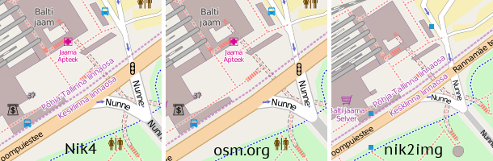
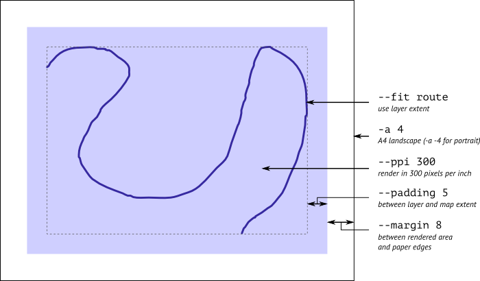
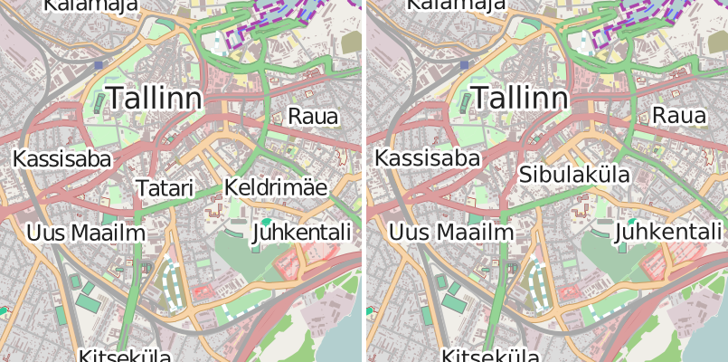

# Nik4

This is a mapnik-to-image exporting script. It requires only `mapnik-python` bindings.
Run it with `-h` option to see available options and their descriptions.

## Why is it better

Nik4 takes great care to preserve values you feed it. If you say you need a 800×600 image,
it won't take a pixel less or more. It won't shrink a bounding box or distort lines when
specifying so called "scale factor". When you need a 300 dpi image, you tell it `--ppi 300`
and can be sure you will get what you intended.

For example, this is a sample rendering of an area in Tallin on zoom 17, by Nik4, Nik2img
and as seen on the default layer on osm.org:

Also it can use real-world units, that is, millimeters (and prefers to). Specify dimensions
for printing, choose bounding box and ppi scale — and the result won't disappoint.

## How to use it

Again, run `./nik4.py -h` to see the list of all available options. Here are some examples.

### Watching a mapping party area

First, if you haven't already, install PostgreSQL+PostGIS and Mapnik, and use osm2pgsql
to populate the database with a planet extract. For instructions see
[here](http://switch2osm.org/loading-osm-data/) or [here](http://wiki.openstreetmap.org/wiki/User:Zverik/Tile_Server_on_Fedora_20).
Get bounds by visiting [osm.org](http://openstreetmap.org): click "Export" and "Choose another region". Then:

    ./nik4.py -b -0.009 51.47 0.013 51.484 -z 17 openstreetmap-carto/osm.xml party-before.png

Here `osm.xml` is the compiled Mapnik style.
Then you can [update](http://wiki.openstreetmap.org/wiki/Minutely_Mapnik) you database and generate
snapshots of an area as it is being mapped. Alternatively, you can specify an area with its center
and desired image size in pixels:

    ./nik4.py -c 0 51.477 --size-px 800 600 -z 17 openstreetmap-carto/osm.xml party-before.png

### Make a georeferenced raster image

Some people prefer planning routes with OziExplorer or similar programs. Or want to take a big
raster map with them on the road. For that a very big image is needed. Usually they turn to
downloading and stitching hundreds of tiles, but with Nik4 you can make Mapnik produce a better
looking map, faster and without bothering tile server administrators.

Since you are not bound to any tile provider, you should employ [TileMill](https://www.mapbox.com/tilemill/)
for customizing your map style: for example, remove forest on low zooms, add contrast to
road lines, render more villages, highlight useful POI and cycling routes.

    ./nik4.py -b 25 61.6 30.6 63.3 -z 13 custom.xml kuopio.png --ozi kuopio.map

This will render 12345x6789 (*todo*) image with a georeferencing file ready to open in OziExplorer.
For a `.wld` file, which can be used in desktop GIS applications or for creating a GeoTIFF file,
use `--wld` option. You can convert png+wld to geotiff with GDAL:

    gdal_translate -of GTiff -a_srs epsg:4326 image.png image.tif

*todo: test, maybe 4326 is a lie*

### Get an image for printing

Let's say you need a 1:50000 image of a city center for printing on a A4 sheet with margins.

*todo*

### Print a route

*todo*

### Generate a vector drawing from a map

It's as easy as adding an `.svg` extension to the output file name.

    ./nik4.py --fit route -a -5 --factor 4 osm.xml map.svg

Why did I use `--factor` (it's the same as using `--ppi 362.8`, which is 90.7 * 4)? Shouldn't
vector images be independent of the resolution? Well, the problem is in label kerning:

Left image was exported with `--factor 1`. You can see in "ali", "sis", "Uus" that distance between
letters is varying unpredictably, not like the font instructs. That's because Mapnik rounds letter widths
to nearest integers, that is, to pixels. By increasing the resolution, you make that granularity finer,
so rounding errors are much less prominent. Labels would become slightly longer, that's why they are
different in the second image.

You can export a map to PDF and be done with it, but often you'd want to do some postprocessing:
move labels away from roads, highlight features, draw additional labels and arrows. For that
I recommend processing the SVG file with [mapnik-group-text](https://github.com/Zverik/mapnik-group-text),
which would allow for easier label movement.

## See also

* [mapnik/demo/python](https://github.com/mapnik/mapnik/tree/master/demo/python)
* [generate\_image.py](http://svn.openstreetmap.org/applications/rendering/mapnik/generate_image.py)
* [mapnik-render-image](https://github.com/plepe/mapnik-render-image)
* [osm.org/export](https://trac.openstreetmap.org/browser/sites/tile.openstreetmap.org/cgi-bin/export)
* [nik2img](http://code.google.com/p/mapnik-utils/wiki/Nik2Img)

For generating tiles, see [polytiles.py](https://github.com/Zverik/polytiles).

## Author and license

The script was written by Ilya Zverev and published under WTFPL.
